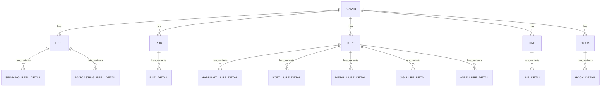

# 装备表关系 (Gear Database Schema & Relationships)

本文档旨在规范 GearSage 装备库数据的导入、导出和表格间的外键关联关系。作为数据抓取与 Excel 数据维护的标准参考。

---

## 1. 核心实体关系 (ER 关系图)

GearSage 的装备数据结构遵循 **“品牌 (Brand) -> 主表 (Master) -> 详情表/子型号 (Variants/Details)”** 的三层树状架构。

---

## 2. 品牌表 (Brand)

*   **表名/文件名**: `brand.xlsx`
*   **层级**: 第 1 层 (顶层)
*   **主键**: `id`（纯数字品牌 ID，例如 `1` 对应 Shimano，`2` 对应 Daiwa）
*   **主要字段**: `name` (品牌名), `name_en`, `name_jp`, `name_zh`, `description`, `site_url`

---

## 3. 装备主表 (Master Tables)

主表定义了一个具体的“装备系列/款式”（例如：Daiwa EXIST 纺车轮）。

### 3.1 渔轮主表 (Reel)
*   **表名/文件名**: `reel.xlsx`
*   **主键**: `id`（字符串前缀 ID，例如 `SR1000`、`DR1000`）
*   **外键**: `brand_id` (关联到 `brand` 表的 `id`)
*   **主要字段**: `model` (型号), `model_cn` (中文名), `model_year` (年份), `alias` (别名), `type_tips` (类型标签), `type` (如 spinning, baitcasting), `images`

### 3.2 鱼竿主表 (Rod)
*   **表名/文件名**: `rod.xlsx`
*   **主键**: `id`（字符串前缀 ID，例如 `MR1000`）
*   **外键**: `brand_id` (关联到 `brand` 表的 `id`)
*   **主要字段**: `model`, `model_cn`, `model_year`, `alias`, `type_tips`, `images`

### 3.3 路亚饵主表 (Lure)
*   **表名/文件名**: `lure.xlsx`
*   **主键**: `id`（字符串前缀 ID，例如 `SL1000`、`DL1000`、`ML1000`、`LF1000`、`YY1000`、`OSP1000`）
*   **外键**: `brand_id` (关联到 `brand` 表的 `id`)
*   **主要字段**: `model`, `model_cn`, `model_year`, `alias`, `type_tips`, `system`, `water_column`, `action`, `images`

### 3.4 鱼线主表 (Line)
*   **表名/文件名**: `line.xlsx`
*   **主键**: `id`（字符串前缀 ID，例如 `DLN1000`、`SLN1000`）
*   **外键**: `brand_id` (关联到 `brand` 表的 `id`)
*   **主要字段**: `model`, `model_cn`, `model_year`, `alias`, `type_tips`, `images`, `description`

### 3.5 鱼钩主表 (Hook)
*   **表名/文件名**: `hook.xlsx`
*   **主键**: `id`（字符串前缀 ID，例如 `GHK1000`）
*   **外键**: `brand_id` (关联到 `brand` 表的 `id`)
*   **主要字段**: `model`, `model_cn`, `model_year`, `alias`, `type_tips`, `images`, `description`

> 当前约定：
> `brand.id` 始终保持纯数字；
> 装备主表与详情表的 `id`、以及详情表外键 `reel_id/rod_id/lure_id/line_id/hookId` 统一使用字符串前缀体系。

---

## 4. 详情表/子型号表 (Detail / Variant Tables)

详情表定义了主表下的每一个具体“规格/子型号”（例如：Daiwa EXIST 的 LT2000S-H 规格）。

### 4.1 渔轮详情表 (Reel Details)
*   **纺车轮详情表**: `spinning_reel_detail.xlsx`
    *   **主键**: `id` (详情表自身的独立唯一 ID)
    *   **外键**: `reel_id` (必须严格等于 `reel.xlsx` 中的 `id`)
    *   **主要业务字段**: `SKU` (子型号名，如 LT2000S-H), `GEAR RATIO`, `MAX DRAG`, `WEIGHT`, `Nylon_lb_m`, `pe_no_m`, `cm_per_turn`, `handle_length_mm`, `bearing_count_roller`, `market_reference_price`
*   **水滴轮详情表**: `baitcasting_reel_detail.xlsx`
    *   **主键**: `id`
    *   **外键**: `reel_id` (必须严格等于 `reel.xlsx` 中的 `id`)
    *   **主要业务字段**: 同纺车轮，部分特定参数有差异。

### 4.2 鱼竿详情表 (Rod Details)
*   **鱼竿详情表**: `rod_detail.xlsx`
    *   **主键**: `id`
    *   **外键**: `rod_id` (必须严格等于 `rod.xlsx` 中的 `id`)
    *   **主要业务字段**: `TYPE`, `SKU`, `TOTAL LENGTH`, `Action`, `PIECES`, `WEIGHT`, `Tip Diameter`, `LURE WEIGHT`, `PE Line Size`, `CONTENT CARBON` 等。
    *   **补充字段**: 历史匿名列已统一命名为 `Extra Spec 1`、`Extra Spec 2`，用于承载额外规格说明或注记。

### 4.3 路亚饵详情表 (Lure Details)
根据不同种类的路亚饵，细分为：
*   `hardbait_lure_detail.xlsx` (硬饵)
*   `soft_lure_detail.xlsx` (软饵)
*   `metal_lure_detail.xlsx` (金属饵)
*   `jig_lure_detail.xlsx` (Jig)
*   `wire_lure_detail.xlsx` (复合饵/亮片)
    *   **外键**: 所有饵的详情表，外键均为 `lure_id` (必须严格等于 `lure.xlsx` 中的 `id`)
    *   **主要业务字段**: `SKU`, `WEIGHT`, `length`, `size`, `sinkingspeed`, `referenceprice`

### 4.4 鱼线详情表 (Line Details)
*   **鱼线详情表**: `line_detail.xlsx`
    *   **主键**: `id`
    *   **外键**: `line_id` (必须严格等于 `line.xlsx` 中的 `id`)
    *   **主要业务字段**: `SKU`, `COLOR`, `LENGTH(m)`, `SIZE NO.`, `MAX STRENGTH(lb)`, `MAX STRENGTH(kg)`, `AVG STRENGTH(lb)`, `AVG STRENGTH(kg)`, `Market Reference Price`, `AdminCode`

### 4.5 鱼钩详情表 (Hook Details)
*   **鱼钩详情表**: `hook_detail.xlsx`
    *   **主键**: `id`
    *   **外键**: `hookId` (必须严格等于 `hook.xlsx` 中的 `id`)
    *   **主要业务字段**: `brand`, `sku`, `type`, `subType`, `gapWidth`, `coating`, `size`, `quantityPerPack`, `price`, `status`, `description`

---

## 5. 数据导入规范 (Import Guidelines)

1. **唯一外键原则**：新爬取的数据如果生成了详情表（例如纺车轮的 `spinning_reel_detail`），必须要在其外键 `reel_id` 中填入主表 `reel.xlsx` 的主键 `id`。
2. **主表同步更新**：如果在导入子型号详情时，发现主表 `reel.xlsx` 中还不存在该型号的记录，则**必须同时**在 `reel.xlsx` 中新增一条数据，并赋予其一个全新的 `id`，以便在详情表中使用。
3. **SKU 定义**：各详情表中的 `SKU` 字段代表的是**子型号的名称**（例如：LT2000S-H），它不应当是条形码（如 JAN 代码的占位符 `*`）。如果是爬虫默认填入的占位符，需要在清洗层进行转码或提取出正确的子型号名称。
